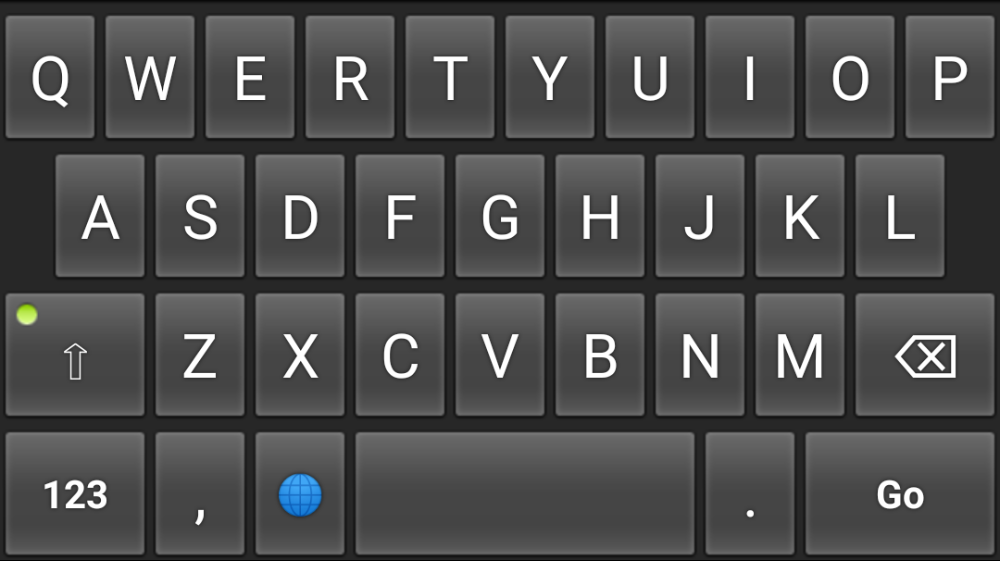

# Tiny Keyboard

## About

- Smallest possible APK size of 26kB (as of version 0.7)
- Permissions: 0
- Supported layouts: en_US
- No Launcher icon and Settings
- Licensed under Apache License Version 2

## How it's made

Android OS contains a default [Keyboard](https://developer.android.com/reference/android/inputmethodservice/Keyboard) and [KeyboardView](https://developer.android.com/reference/android/inputmethodservice/KeyboardView) implementations (deprecated as of Android 10, but still available). Input method developers can use these classes as base for their own keyboard implementations. Tiny Keyboard is an implementation without any changes.

All that is contained in application source is key layouts and special handling for action keys.

## The future

The goal of this keyboard will stay a minimal size. Any functionality that doesn't increase the size drastically can be included. Check the Issues tab to see what is planned or request functionality.

Keyboard logic and view code may need to move into the application due to:
- Being deprecated in Android 10
- Implementations may differ across Android versions in a breaking way
- Implementations may differ across vendors in a breaking way
- Modifications are limited by exposed interfaces
- Provided implementation has bugs

## Downloads

      
## Credits

Based on https://android.googlesource.com/platform/development/+/master/samples/SoftKeyboard

AOSP Keyboard.java: https://android.googlesource.com/platform/frameworks/base/+/master/core/java/android/inputmethodservice/Keyboard.java

AOSP KeyboardView.java: https://android.googlesource.com/platform/frameworks/base/+/master/core/java/android/inputmethodservice/KeyboardView.java
